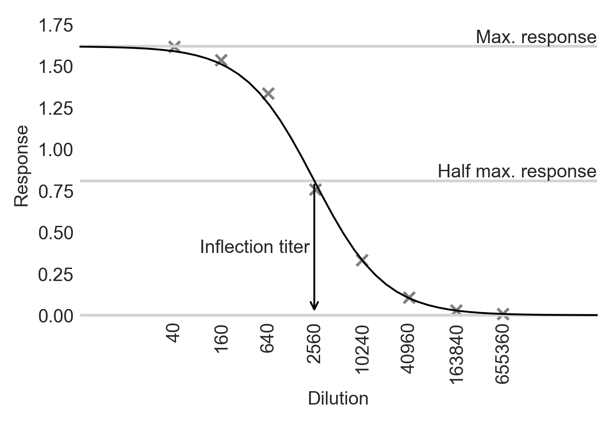

ititer
======

Serial dilution assays are widespread in biology.
Typically, measurements are taken on serially diluted samples, yielding data that fit sigmoid curves.
The position of the sigmoid curve is captured by its inflection point, or **inflection titer**, which can then be compared among samples.

Alternatively, the dilution at which the measurement drops below a cut-off value can be measured.
This is known as an **endpoint titer**.

Investigators often measure all samples at many dilutions (typically 8-12).
This is usually overkill as the underlying sigmoid curve can be recovered by many fewer dilutions.

**ititer** uses Bayesian hierarchical modelling to pool inference of sigmoid curve characteristics that are shared among samples, which further reduces the number dilutions required to infer inflection or endpoint titers.

Applied to a SARS-CoV-2 and human seasonal coronavirus ELISA dataset, just 3 dilutions yielded the same inflection and endpoint titers as 8 dilutions (:doc:`Pattinson et al. 2022<./citation>`).

Highlights
----------

* Simple interface aimed at enabling investigators with basic knowledge of python to conduct analyses.
* Substantially decrease workload associated with serial dilution assays.
* Flexibly incorporate different prior knowledge about experimental systems to facilitate inference.

Contents
--------

.. toctree::
   :maxdepth: 2

   quick
   tutorial
   inference
   commands
   citation

* :ref:`genindex`

Installation
------------

ititer is available from pip:

.. code-block:: bash

    $ pip install ititer
