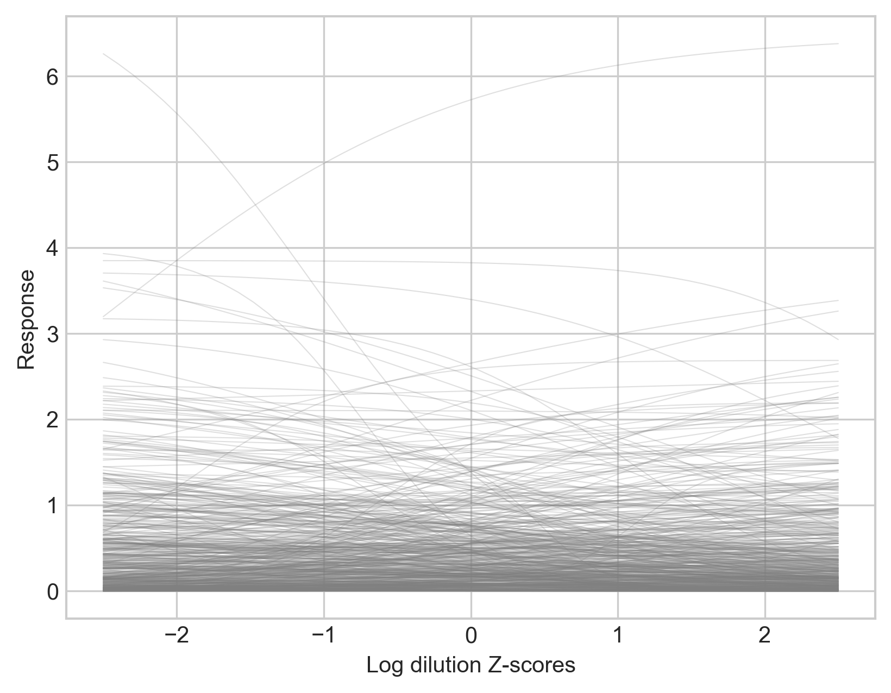

Bayesian Inference
==================

:py:mod:`ititer` uses Bayesian inference to infer posterior distributions of sigmoid curve parameters.

Formally, the response of sample `i`, :math:`y_i`, is modelled as a function of log dilution using a four parameter logistic curve, :math:`x_i`:

.. math::

    \mu_i = c + \frac{d}{1 + e^{-b(x_i - a)}}

    \sigma \sim \text{dexp}(1)

    y_i \sim \text{dnorm}(\mu_i, \sigma)

Parameters are interpreted as follows:

* :math:`a` - horizontal location of the sigmoid
* :math:`b` - gradient at the inflection point
* :math:`c` - minimum response
* :math:`d` - difference between minimum and maximum

Parameters can either be set *a priori*, inferred using full pooling (yielding a single distribution from all samples), or inferred using partial pooling (where each sample gets its own posterior distribution).

Standardizing
-------------

Log dilution is standardized to have mean of zero and standard deviation of one for inference.

Response is left unstandardized in order to set informative priors for `c` and `d`.
For instance, it is often known *a priori* that at theoretical minimum or maximum concentrations the response will have some known value.

Priors
------

Weakly informative priors are used by default throughout.
When parameters `a`, `b`, and `c` are fully pooled, they given a prior of :math:`\text{dnorm}(0, 1)`.
When `a`, `b`, and `c` are partially pooled across samples, `s`, they are given priors of:

.. math::

    \mu_p \sim \text{dnorm}(0, 1)

    \sigma_p \sim \text{dexp}(1)

    p_s \sim \text{dnorm}(\mu_p, \sigma_p)

To prevent redundancy between the values of `c` and `d`, `d` is constrained to be positive.
When it is fully pooled: :math:`d \sim \text{dexp}(1)`.
When it is partially pooled:

.. math::

    \sigma_d \sim \text{dexp}(1)

    d_s \sim \text{dexp}(\sigma_d)

These priors will be applicable for most users.

Partial pooling for `a`, full pooling for `b` and `d`, and setting `c=0` gives the following prior predictive distribution:

Code used to generate this figure:

.. literalinclude:: prior-predictive.py
