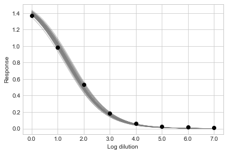

Tutorial
========

Load some example data using :py:mod:`ititer` and look at the first 10 rows:

.. code-block:: python

    import ititer as it
    df = it.load_example_data()
    df.head(10)

.. csv-table::
   :header: Sample,OD,Dilution
   :widths: 20, 10, 10

   21-P0004-v001sr01,1.371,40
   21-P0004-v001sr01,0.981,160
   21-P0004-v001sr01,0.535,640
   21-P0004-v001sr01,0.182,2560
   21-P0004-v001sr01,0.064,10240
   21-P0004-v001sr01,0.027,40960
   21-P0004-v001sr01,0.015,163840
   21-P0004-v001sr01,0.010,655360
   21-P0034-v001sr01,0.948,40
   21-P0034-v001sr01,0.452,160

Each row contains information about a single OD measurement; the sample, OD value and the dilution factor.
The measurements for the first sample, ``21-P0004-v001sr01`` are in the first 8 rows, followed by those for ``21-P0034-v001sr01``.

This is known as *long format* data.

Wide format data
----------------

If your data is in *wide format*,
for instance perhaps each row contains mulitple OD values at different dilutions for a single sample (see below),
then use `pandas.DataFrame.melt() <https://pandas.pydata.org/docs/reference/api/pandas.DataFrame.melt.html>`_ to generate a long format DataFrame.

Example wide format data:

.. csv-table::
   :header: Sample,40,160,640,2560,10240,40960,163840,655360
   :widths: 20, 10, 10, 10, 10, 10, 10, 10, 10

   21-P0004-v001sr01,1.371,0.981,0.535,0.182,0.064,0.027,0.015,0.01
   21-P0034-v001sr01,0.948,0.452,0.185,0.043,0.016,0.004,0.002,-0.001
   21-P0050-v001sr01,1.418,1.253,0.972,0.393,0.152,0.049,0.018,0.011

For a DataFrame like this the ``melt`` call would be:

.. code-block:: python

    df.reset_index().melt(id_vars="Sample", var_name="Dilution", value_name="OD")

Log transform dilutions
-----------------------

Next, we need to transform the dilutions (which increase logarithmically) to values that increase linearly.
This will mean that when the data are plotted, the values will be evenly spaced on the x-axis.

There is a helper function for doing this called :py:func:`~.ititer.titer_to_index`.
The ``titer`` argument is the dilutions, ``start`` is the first dilution in the dilution series, and ``fold`` sets the fold change in concentration at each step in the dilution series.
We can call the function and store the returned value as a new column in our DataFrame:

.. code-block:: python

    df["Log Dilution"] = it.titer_to_index(titer=df["Dilution"], start=40, fold=4)

Fit curves
----------

We are now ready to fit sigmoid curves for each sample.

We want partial pooling between samples for inference of the ``a`` parameter to give us one estimate of ``a`` for each sample.
We know *a priori* that the response will be 0 at a theoretical infinite dilution, so we can set ``c=0``.
We will use full pooling for ``b`` and ``d`` because we expect the gradient of the sigmoid curve (``b``) and its height above baseline (``d``) to be the same across samples.

We make a new :py:class:`~.ititer.Sigmoid` object that has these properties:

.. code-block:: python

    sigmoid = it.Sigmoid(a="partial", b="full", c=0, d="full")

Now we call the :py:meth:`~.ititer.Sigmoid.fit` method to infer the posterior distributions of the model parameters, and supply the data from our long format DataFrame:

.. code-block:: python

    posterior = sigmoid.fit(
        log_dilution=df["Log Dilution"], response=df["OD"], sample_labels=df["Sample"]
    )

Various messages will print displaying information about the sampling of the posterior distribution.

.. code-block:: text

    Auto-assigning NUTS sampler...
    Initializing NUTS using jitter+adapt_diag...
    Multiprocess sampling (4 chains in 4 jobs)
    NUTS: [sigma, d, b, a, sigma_a, mu_a]
    Sampling 4 chains for 1_000 tune and 10_000 draw iterations (4_000 + 40_000 draws total) took 25 seconds.]

Visualize curves
----------------

It is generally a good idea to visualize the model fits.
To inspect an individual sample of interest use the :py:meth:`~.ititer.Sigmoid.plot_sample` method, and pass it the sample name you want to see.
By default this method shows a selection of sigmoid curves from the posterior distribution.
Above, :py:meth:`~.ititer.Sigmoid.fit` took 10,000 samples from the posterior distribution.
Here, ``step=1000`` means that every 1,000\ :sup:`th` sample will be shown, resulting in 10,000 / 1000 = 10 lines in total.

.. code-block:: python

    posterior.plot_sample("21-P0004-v001sr01", step=1000)

Looking at samples from the posterior distribution tells you how confident the model is in the model fit.
Sparser data or data that aren't well arranged in a sigmoid curve will yield more dispersed lines.

You can take the mean value of each parameter from the posterior distribution and plot the resulting sigmoid curve by passing ``mean=True``:

.. code-block:: python

    posterior.plot_sample("21-P0004-v001sr01", step=1000, mean=True)

.. image:: 1-sample-mean.png

To visualize multiple samples at once, pass a list of sample names to :py:meth:`~.ititer.Sigmoid.plot_samples`:

.. code-block:: python

    posterior.plot_samples(["21-P0833-v001sr01", "21-P0834-v001sr01"])

.. image:: 2-samples.png

Or, to show all samples use :py:meth:`~.ititer.Sigmoid.plot_all_samples`:

.. code-block:: python

    posterior.plot_all_samples()

.. image:: all-samples.png

Matplotlib is used for all plotting.
See the `matplotlib documentation <https://matplotlib.org/>`_ for help on customizing and saving figures.

Inflection titers
-----------------

The degree to which a sigmoid curve is shifted left or right on the x-axis is often the point of interest to compare between samples.
This is described by the inflection point of the curve, caculated by :py:meth:`~.ititer.Sigmoid.inflections`:

.. code-block:: python

    df_inflections = posterior.inflections(hdi_prob=0.95)
    df_inflections.head().round(2)

.. csv-table::
    :header: sample,mean,median,hdi low,hdi high
    :widths: 20, 12, 12, 12, 12

    21-P0425-v001sr01,0.91,0.91,0.78,1.04
    21-P0917-v001sr01,1.82,1.82,1.7,1.96
    21-P0796-v001sr01,2.51,2.51,2.39,2.64
    21-P0680-v001sr01,2.04,2.04,1.91,2.17
    21-P0800-v001sr01,4.47,4.47,4.35,4.6

``hdi low`` and ``hdi high`` refer to the low and high boundary of the Highest Density Interval (HDI).
An HDI is the narrowest set of parameter values that contain a certain mass of the posterior probability density - it is a type of confidence interval for a parameter.
Here, we specified an HDI probability of 0.95 (which is also the default value for the :py:meth:`~.ititer.Sigmoid.inflections`: method).
Note, there is nothing particularly special about a value of 0.95

Values in this DataFrame are on the log dilution scale; i.e. they tell you the position in the dilution series of the inflection point.
To get values on the dilution scale use :py:func:`~.ititer.index_to_titer`:

.. code-block:: python

    df_inflection_titers = it.index_to_titer(df_inflections, start=40, fold=4)
    df_inflection_titers.head().round(2)

.. csv-table::
    :header: sample,mean,median,hdi low,hdi high
    :widths: 20, 12, 12, 12, 12

    21-P0425-v001sr01,141.43,141.58,117.89,169.98
    21-P0917-v001sr01,501.36,501.69,422.53,601.65
    21-P0796-v001sr01,1294.1,1294.03,1102.35,1544.14
    21-P0680-v001sr01,676.47,676.82,563.92,807.78
    21-P0800-v001sr01,19699.43,19744.58,16530.67,23644.44

Endpoint titers
---------------

Endpoint titers can also be computed.
An endpoint titer is the dilution at which the response drops below a certain value, known as the cutoff.
Choice of cutoff is somewhat arbitrary, but is usually some low absolute value, or a low proportion of the maximal response.
Use :py:meth:`~.ititer.Sigmoid.endpoints` to compute endpoints:

.. code-block:: python

    df_endpoints = posterior.endpoints(cutoff_proportion=0.1, hdi_prob=0.95)
    df_endpoints.head().round(2)

.. csv-table::
    :header: sample,mean,median,hdi low,hdi high
    :widths: 20, 12, 12, 12, 12

    21-P0425-v001sr01,2.94,2.94,2.80,3.08
    21-P0917-v001sr01,3.85,3.85,3.72,3.99
    21-P0796-v001sr01,4.54,4.54,4.41,4.66
    21-P0680-v001sr01,4.07,4.07,3.93,4.20
    21-P0800-v001sr01,6.50,6.50,6.37,6.63

Like inflection points, the values in this DataFrame are on the log dilution scale.
Use :py:func:`~.ititer.index_to_titer` to put them on the dilution scale.
